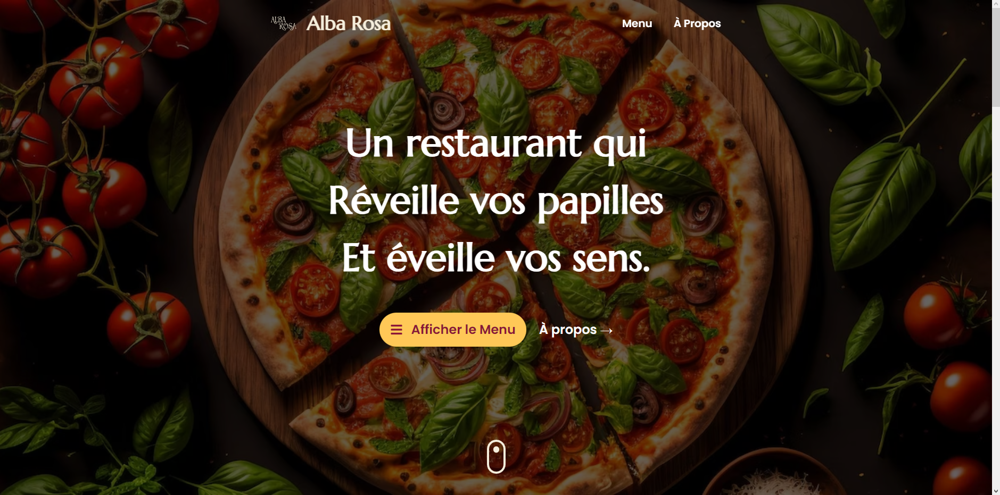
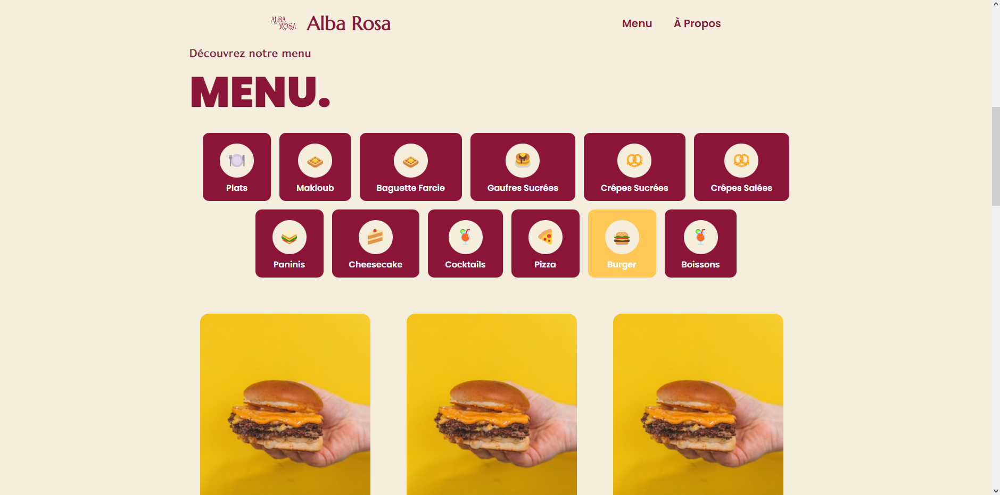
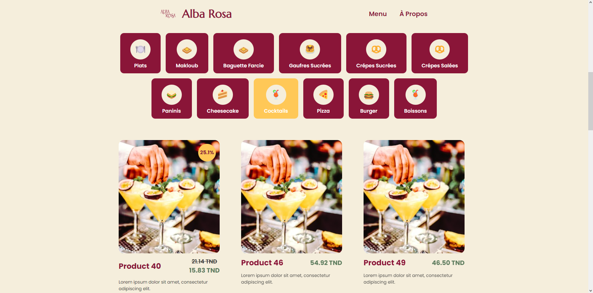
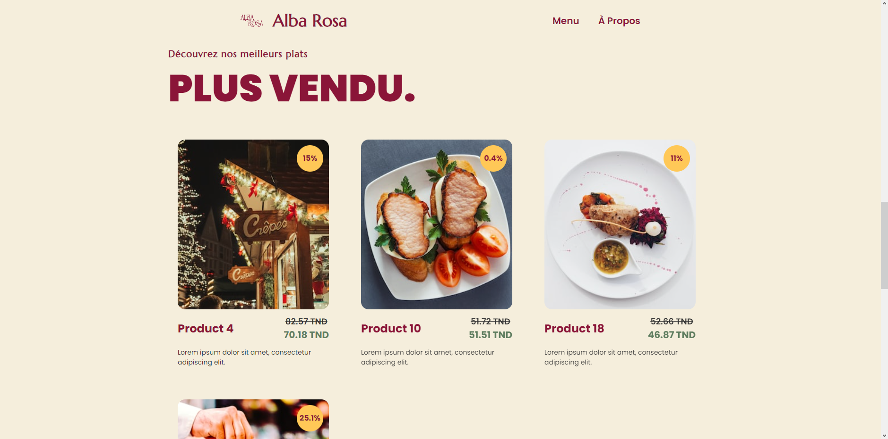
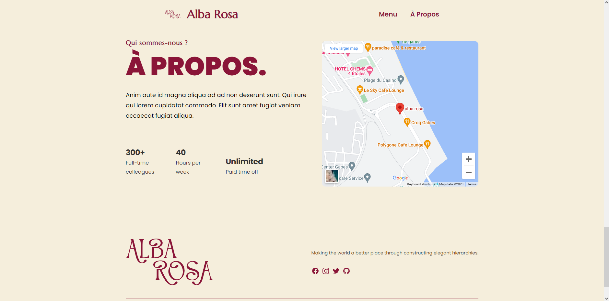

# Alba Rosa

Experience AlbaRosa, a next-level restaurant lounge where dining meets digital innovation. Scan the unique table QR code, access our digital menu, and effortlessly order from your phone. Elevate your dining experience with AlbaRosa's seamless fusion of technology and gastronomy.
## Demo

Check out the live demo of Alba Rosa [here](https://albarosa.vercel.app).

## Screenshots

*Screenshot of the Hero section*

*Screenshot of the Food Categories section*

*Screenshot of the Menu Section mondal*

*Screenshot of the Discounted Products section*

*Screenshot of the About Us section*

## Installation

1. Clone this repository: `git clone https://github.com/NidhalChelhi/Alba-Rosa.git`.
2. Navigate to the project directory: `cd alba-rosa`.
3. Install dependencies: `npm install`.
4. Start the development server: `npm run dev`.

## Contributing

Contributions are welcome! Feel free to open issues or pull requests.

---

Made with 🤍 by: [Nidhal Chelhi](https://nidhalchelhi.vercel.app)
